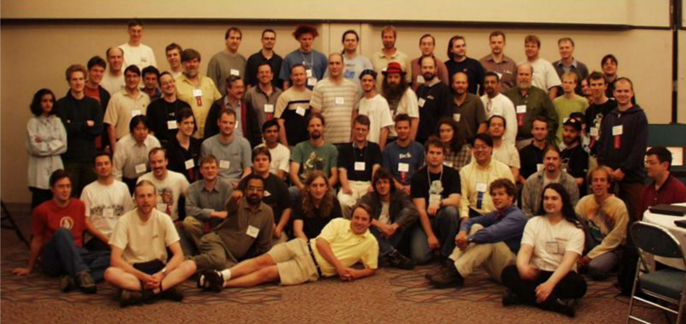

# 服务器三大操作系统

- windows
- Linux
- Unix 

# UNIX历史

- 1965前后 Multics
  贝尔实验室,麻省理工,通用电气发起
- 1969 Unix雏形UNICS
  Ken Thompson 汇编语言 B语言
- 1973 正式命名为Unix
  Dennis Ritchie C语言
- 1977 BSD
  Berkeley Software Distribution  伯克利大学
- 1979 System V架构 版权声明
  HP-UNIX IBM AIX “不对学生提供源码” 收回版权
- 1984年 Minix操作系统
  Andrew S. Tanenbaum荷兰阿姆斯特丹自由大学计算机科学系

# Ken Thompson:一切为了游戏

1966年从加州大学伯克利分校毕业的Ken Thompson加入了贝尔实验室。参与了Multics系统的研发。他基于Multics开发了“star travel”游戏。不幸的是，1969年由于贝尔实验室退出Multics项目，这同时意味着Ken将没有机器可以再玩这个游戏了。面对此情此景，Ken作为一个创造者的本性立即体现了出来，于是他决定自己写一个操作系统来满足他玩游戏的需要，Ken找到了一台废弃已久的老式PDP-7，并在这台机器上重写了他的游戏。在这个过程中，Ken有了一个主意，要开发一个全新的操作系统。利用PDP-7上的汇编语言，Ken只花了一个月就编写完了操作系统的内核，在这个一个月中，他一周一个内核，一个文件系统，一个编辑器和一个编译程序的完成

# linux起源

1991年初，林纳斯·托瓦兹开始在一台386sx兼容微机上学习minix操作系统。1991年4月，林纳斯·托瓦兹开始酝酿并着手编制自己的操作系统。

1991 年4 月13 日在comp.os.minix 上发布说自己已经成功地将bash 移植到了minix 上，而且已经爱不释手、不能离开这个shell软件了。

1991年7月3日，第一个与Linux有关的消息是在comp.os.minix上发布的（当然此时还不存在Linux这个名称，当时林纳斯·托瓦兹的脑子里想的可能是FREAX，FREAX的英文含义是怪诞的、怪物、异想天开等）。

1991年的10月5日，林纳斯·托瓦兹在comp.os.minix新闻组上发布消息，正式向外宣布Linux内核的诞生（**Freeminix-like**kernel sources for 386-AT）。

[官方网站](www.kernel.org)

# linux团队

# linux内核

linux的内核版本由三部分组成

- 主版本号
- 次版本号
- 末版本号

系统的版本号组成

- 主版本号
- 次版本号
- 末版本号
- 打包版本号（第多少次打包）
- 厂商版本

# linux发型版本

# 开源协议

- GPLv2, GPLv3, LGPL(lesser) :通用公共许可 copyleft

- Apache: apache

- BSD: bsd

- Mozilla

- MIT

- 。。。

  

# Linux哲学思想

- 一切都是一个文件（包括硬件）
- 小型，单一用途的程序
- 链接程序，共同完成复杂的任务
- 避免令人困惑的用户界面
- 配置数据存储在文本中

# 获取发行版

https://wiki.centos.org/Download 

http://mirrors.aliyun.com 

http://mirrors.sohu.com 

http://mirrors.163.com

