# 计算机基础

## 计算机系统

计算机系统由硬件(Hardware)系统和软件(Software)系统两大部分组成

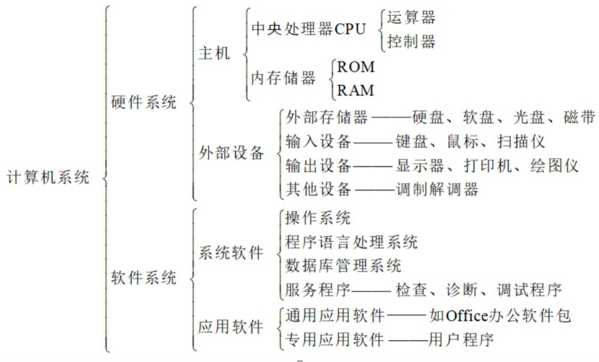

## 计算机硬件

### 发展历史

- 第一代计算机(1946-1957)	电子管时代
- 第二代计算机(1958-1964)	晶体管时代
- 第三代计算机(1965-1970)	集成电路时代
- 第四代计算机(1971以后)	大规模集成电路时代

1946年,世界上第一台计算机ENIAC(electronic numerical integrator and calculator)在美国宾州大学诞生，是美国奥伯丁武器试验场为了满足计算弹道需要而研制成的。使用了17468只电子管，占地170平方米,重达30吨，耗电174千瓦，耗资40多万美元。每秒可进行5000次加法或减法运算

## 世界第一台计算器

## 计算机硬件组成

冯·诺依曼体系结构： 1946年数学家冯·诺依曼于提出，计算机硬件由运算器、控制器、存储器、输入设备和输出设备五大部分组成

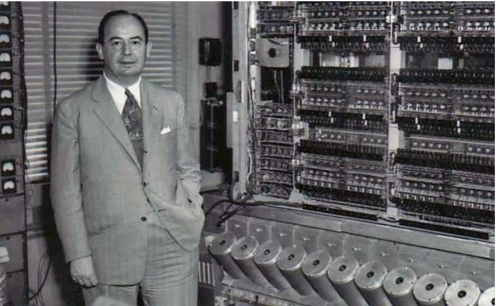

## 划分

### 按规模划分

- 巨型计算机：应用于国防尖端技术和现代科学计算中。巨型机的运算速度可达每秒百万亿次以上， “天河一号”为我国首台千万亿次超级计算机
- 大型计算机：具有较高的运算速度，每秒可以执行几千万条指令，而且有较大的存储空间。往往用于科学计算、数据处理或作为网络服务器使用，如：IBM z13 mainframe
- 小型计算机：规模较小、结构简单、运行环境要求较低，一般应用于工业自动控制、测量仪器、医疗设备中的数据采集等方面
- 微型计算机：中央处理器（CPU）采用微处理器芯片，体积小巧轻便，广泛用于商业、服务业、工厂的自动控制、办公自动化以及大众化的信息处理

 ### 服务器

- 服务器Server是计算机的一种，是网络中为客户端计算机提供各种服务的高性能的计算机，服务器在网络操作系统的控制下，将与其相连的硬盘、磁带、打印机及昂贵的专用通讯设备提供给网络上的客户站点共享，也能为网络用户提供集中计算、信息发布及数据管理等服务
- 服务器按应用功能可分为：
  Web服务器、数据库服务器、文件服务器、中间件应用服务器、日志服务器、监控服务器、程序版本控制服务器、虚拟机服务器、邮件服务器、打印服务器、域控制服务器、多媒体服务器、通讯服务器、ERP服务器等
- 服务器按外形分类：
  塔式服务器、刀片式服务器、机架式服务器

### 塔式Tower服务器

- 早期的服务器形式

- 外形以及结构和平时使用的立式PC差不多

- 机箱空间大，主板扩展性较强，插槽较多

- 预留了足够的内部空间，以便日后进行硬盘和电源的冗余扩展，设计一般都考虑降噪

- 目前较少使用

  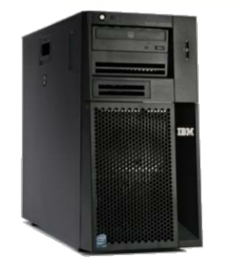

### 刀片式Blade服务器

- 在标准高度的机架式机箱内可插装多个卡式的服务器单元，实现高可用和高密度

- 更高的密度，集中管理，高性能，灵活扩展，按需配置

- 可以使用系统软件将这些母板集合成一个服务器集群。在集群模式下，所有的母板可以连接起来提供高速的网络环境，并同时共享资源，为相同的用户群服务

  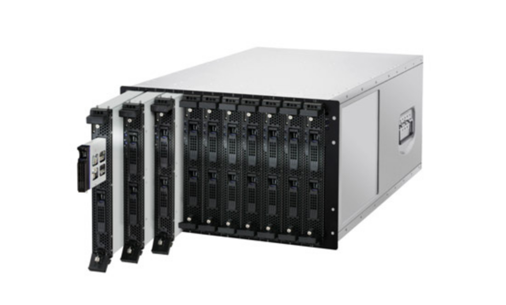

### 机架式Rack服务器

- 按照统一标准设计，配合机柜统一使用

- 便于统计管理，高密度，节省空间

- 机架服务器的宽度为19英寸（48.26cm），高度以U为单位，如42U

- 1U=1.75英寸=44.45毫米，通常有1U，2U，3U，4U，5U，7U几种标准的服务器。机柜的尺寸也是采用通用的工业标准

- 现阶段销售数量最多的服务器

- 机箱尺寸比较小巧

- 在机柜中可以同时放置多台服务器

  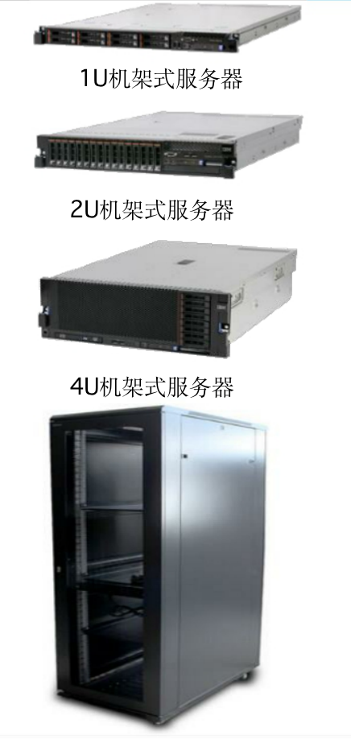

### 服务器硬件组成

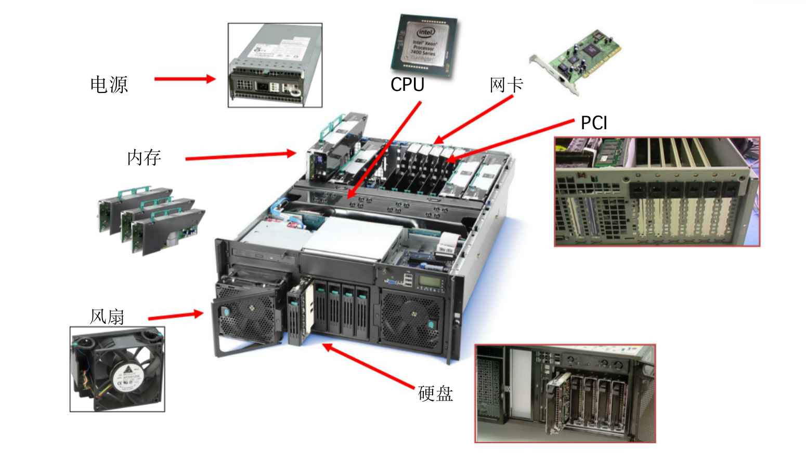

### 服务器硬件-CPU

- CPU是Central Processing Unit的缩写，即中央处理器。由控制器和运算器构成，是整个计算机系统中最重要的部分

- 服务器CPU公司

  - Intel
    - Xeon	至强
    - Itanium  安腾
  - AMD
    - Althlon MP
  - IBM
    - Power

  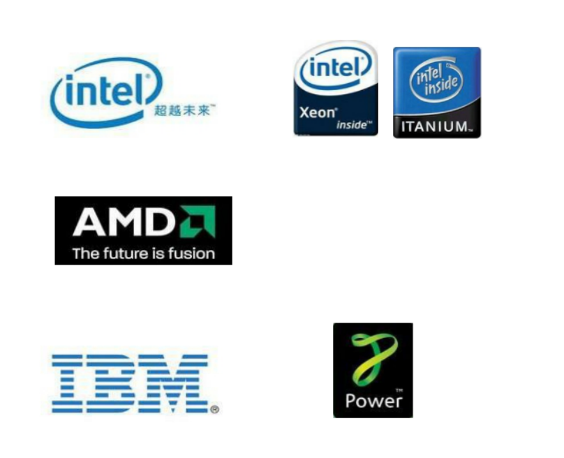

### 服务器分类

按照CPU体系架构来区分，服务器主要分为两类：

- 非x86服务器：使用RISC（精简指令集）或EPIC（并行指令代码） 处理器，并且主要采用UNIX和其它专用操作系统的服务器，指令系统相对简单，它只要求硬件执行很有限且最常用的那部分执令，CPU主要有Compaq的Alpha、HP的PA-RISC、IBM的Power PC、MIPS的MIPS和SUN的Sparc、Intel研发的EPIC安腾处理器等。这种服务器价格昂贵，体系封闭，但是稳定性好，性能强，主要用在金融、电信等大型企业的核心系统
- x86服务器：又称CISC（复杂指令集）架构服务器，即通常所讲的PC服务器，它是基于PC机体系结构，使用Intel或其它兼容x86指令集的处理器芯片的服务器。目前主要为intel的Xeon E3，E5，E7系列，价格相对便宜、兼容性好、稳定性较差、安全性不算太高

### 服务器硬件---主板

- 主板mainboard、系统板systemboard或母板motherboard，安装在机箱内，是计算机最基本的也是最重要的部件之一
- 主板一般为矩形电路板，上面安装了组成计算机的主要电路系统，一般有BIOS芯片、I/O控制芯片、键盘和面板控制开关接口、指示灯插接件、扩充插槽、主板及插卡的直流电源供电接插件等元件

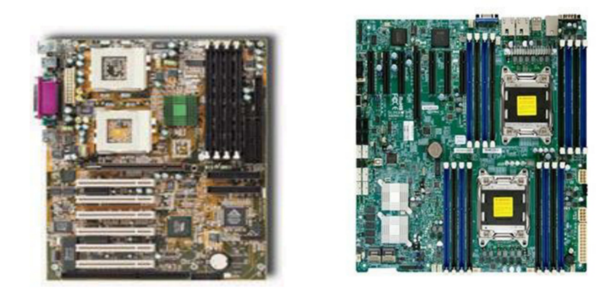

### 服务器硬件---内存

- 内存是介于CPU 和外部存储之间，是CPU 对外部存储中程序与数据进行高速运算时存放程序指令、数据和中间结果的临时场所，它的物理实质就是一组具备数据输入输出和数据存储功能的高速集成电路
- 内存是CPU能直接寻址的存储空间，由半导体器件制成。内存的特点是存取速度快
- 计算机中所有程序的运行都是在内存中进行的，因此内存的性能对计算机的影响非常大
- 外存：硬盘，U盘，软盘，光盘
- 内存和外存的区别：
  - 内存断电后数据丢失
  - 外存断电后数据可以保存

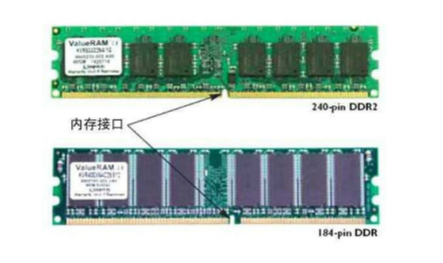

### 服务器硬件---硬盘

机械硬盘结构：

- 存储介质（Media）——盘片
  盘片的基板是金属或玻璃材质制成，为达到高密度高稳定的质量，基板要求表
  面光滑平整，不可有任何暇疵

- 读写头（Read Write Head）——磁头
  磁头是硬盘读取数据的关键部件，它的主要作用就是将存储在硬盘盘片上的磁
  信息转化为电信号向外传输

- 马达（ Spindle Motor & Voice Coil Motor ）
  马达上装有一至多片盘片，以7200，10000，15000 RPM等定速旋转，为保持
  其平衡不可抖动，所以其质量要求严谨，不产生高温躁音

  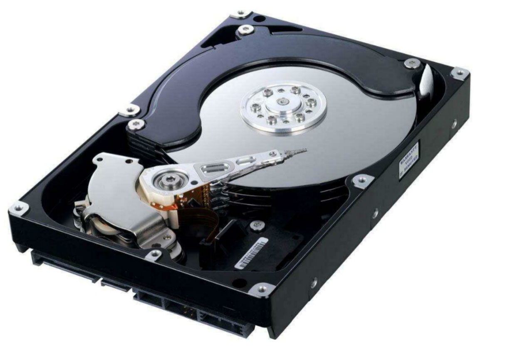

  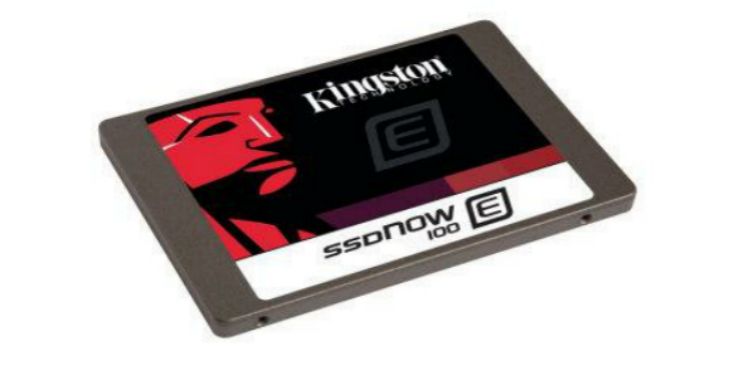

- 硬盘接口类型：

  - IDE接口：硬盘接口规范，采用ATA技术规范
  - SCSI接口：应用于小型机上的高速数据传输技术
  - SATA接口： Serial ATA，提高传输速率，支持热插拔
  - SAS接口： Serial Attached SCSI，兼容SATA
  - 目前主流的硬盘接口为SATA和SAS接口

### 服务器硬件---阵列卡

Raid卡：

- 用来实现RAID的建立和重建，检测和修复多位错误，错误磁盘自动检测等功能。RAID芯片使CPU的资源得以释放
- 阵列卡（RAID卡）的作用
  - 阵列卡把若干硬盘驱动器按照一定要求组成一个整体、由阵列控制器管理的系统。
  - 阵列卡用来提高磁盘子系统的性能及可靠性
  - 阵列卡参数
  - 支持的RAID级别(0 1 5 6 10)
  - 阵列卡缓存
  - 电池保护

### 服务器硬件---电源

电源和风扇

- 支持服务器的电力负载
-  支持冗余，防止电源故障
  - 故障预警和防止
  - 故障之前的预防性维护
  - 保证服务器持续运行
- 电源子系统包括
  - 智能电源和风扇
  - 冗余电源和风扇

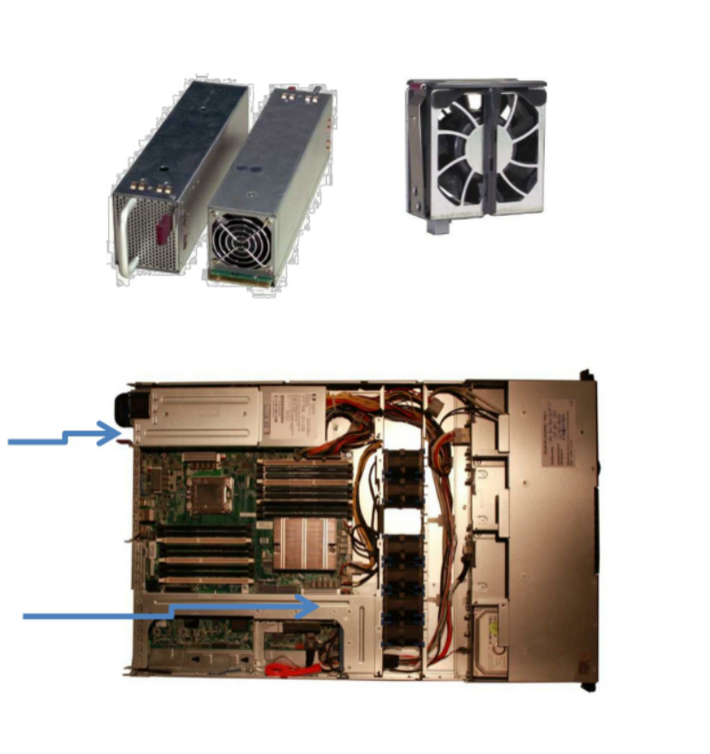

### 服务器硬件---显卡

服务器都在主板上集成了显卡，但是显存容量不高，一般为16M或32M GPU： Graphic Processing Unit，即“图形处理器”

### 服务器硬件---网卡

服务器都在主板上集成了网卡，传输速率为1Gbps，即千兆网卡
特殊应用需要高端网卡，如光纤网卡，Infiniband网卡等，传输速率能达到10Gbps、20Gbps，即万兆网卡

### 服务器硬件---热插拔技术

热插拔技术

- 称为热交换技术（Hot  Swap），允许在不关机的状态下更换故障热插拔设备
- 常见的热插拔设备：硬盘，电源，PCI设备，风扇等
- 热插拔硬盘技术与RAID技术配合起来，可以使服务器在不关机的状态下恢复故障硬盘上的数据，同时并不影响网络用户对数据的使用

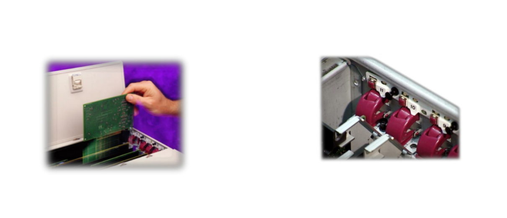

### 服务器硬件---机柜

机架式服务器-服务器放置在机柜中
通常使用的机柜是42U（约2米高）机柜（ 1U=44.45mm）外观尺寸一般为：宽600*深1000*高2000（mm）

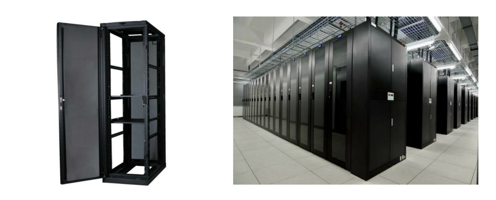

# 服务器配置实例

| **No** | **指标项**                                      | **指标要求**                                                 |
| ------ | ----------------------------------------------- | ------------------------------------------------------------ |
| **1**  | **Intel** **处理器**                            | **标配****2****个****Intel6****核****XeonE7-4809v2****处理器****(1.9GHz,12M****缓存****,6.4G****T/s)** |
| **2**  | **处理器的数量****(****配置****/****最多****)** | **2****/****2**                                              |
| **3**  | **内存**                                        | **128GB(****4****x8GB)1600MHzDDR3****内存**                  |
| **4**  | **硬盘**                                        | **IBM** **1TB** **7.2K** **6Gbps** **SAS** **2.5"** **SFF** **Slim-HS**  **HDD** |
| **5**  | **RAID卡**                                      | **标配****M5210****支持****RAID****0****、****1****、****10****可选缓存或****Flash****保护** |
| **6**  | **网络**                                        | **4****口个千兆以太网卡**                                    |
| **7**  | **光驱**                                        | **DVD****-****ROM**                                          |
| **8**  | **整机保修时间**                                | **原厂****3****年****7*********24****(****4****小时之内携带备件现场服务****)** |
| **9**  | **电源**                                        | **标配****2****个****900****W****热插拔电源****(****带****2****根****PDU****电源线****)** |
| **10** | **服务器的外观****样式**                        | **4U****机架式****(****含上机架导轨****)**                   |

### 操作系统

- OS: Operating System，通用目的的软件程序
  - 硬件驱动
  - 进程管理
  - 内存管理
  - 网络管理
  - 安全管理
  - 文件管理
- OS分类：
  - 服务器OS：RHEL, CentOS,Windows Server,AIX
  - 桌面OS：Windows 10,Windows 7,Mac OS，Fedora
  - 移动设备OS：Andriod,IOS,YunOS